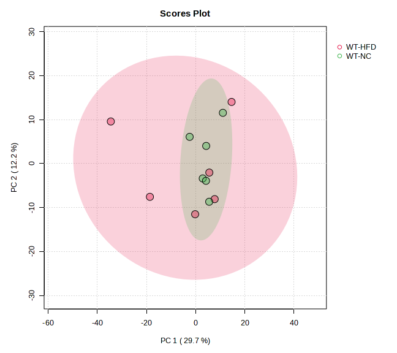

## PCA

### WT-NC vs WT-HFD

**Scores Plot of PCA**

This figure shows a Principal Component Analysis (PCA) scores plot
illustrating the variations in metabolite profiles of mice under WT-NC
and WT-HFD groups. Each point represents a sample, with clusters
indicating separation or overlap between the two groups based on their
metabolic profiles.

The first and second principal components explain approximately 30% and
12% of the total variation in metabolites for mice under WT-NC and
WT-HFD groups.

Each point represents a sample, with colors indicating different groups.
The PERMANOVA test shows no significant difference in centroids between
WT-NC and WT-HFD groups (PERMANOVA F-value: 0.85366; R-squared:
0.078652; p-value (based on 999 permutations): 0.457).

**Figure 5. PCA Scores Plot - Metabolite Profile Variations in Mice
under WT-NC and WT-HFD groups**

**Loadings of PCA**

This table lists the PCA loadings for the top 20 metabolites
contributing to the variation in metabolite profiles of mice under WT-NC
and WT-HFD groups. Higher loadings indicate greater influence of a
metabolite on the principal components, highlighting the most
significant contributors to the observed metabolic differences between
the two groups.

The original, full loading table can be found in the appendix,
../data/Download\_WT-NC\_WT-HFD/pca\_loadings.csv

<table>
<thead>
<tr class="header">
<th style="text-align: left;">Metabolites</th>
<th style="text-align: left;">class</th>
<th style="text-align: left;">PC1</th>
<th style="text-align: left;">PC2</th>
<th style="text-align: left;">PC3</th>
<th style="text-align: left;">PC4</th>
<th style="text-align: left;">PC5</th>
</tr>
</thead>
<tbody>
<tr class="odd">
<td style="text-align: left;">Hypoxanthine</td>
<td style="text-align: left;">Nucleobases Related</td>
<td style="text-align: left;">0.072</td>
<td style="text-align: left;">-0.014</td>
<td style="text-align: left;">-0.002</td>
<td style="text-align: left;">-0.017</td>
<td style="text-align: left;">-0.007</td>
</tr>
<tr class="even">
<td style="text-align: left;">SM C18:0</td>
<td style="text-align: left;">Sphingolipids</td>
<td style="text-align: left;">0.072</td>
<td style="text-align: left;">0.002</td>
<td style="text-align: left;">0.006</td>
<td style="text-align: left;">0.014</td>
<td style="text-align: left;">-0.012</td>
</tr>
<tr class="odd">
<td style="text-align: left;">Trp</td>
<td style="text-align: left;">Aminoacids</td>
<td style="text-align: left;">0.072</td>
<td style="text-align: left;">0.000</td>
<td style="text-align: left;">-0.009</td>
<td style="text-align: left;">-0.022</td>
<td style="text-align: left;">-0.001</td>
</tr>
<tr class="even">
<td style="text-align: left;">SM C16:0</td>
<td style="text-align: left;">Sphingolipids</td>
<td style="text-align: left;">0.071</td>
<td style="text-align: left;">-0.016</td>
<td style="text-align: left;">0.007</td>
<td style="text-align: left;">0.008</td>
<td style="text-align: left;">-0.007</td>
</tr>
<tr class="odd">
<td style="text-align: left;">PC aa C34:4</td>
<td style="text-align: left;">Glycerophospholipids</td>
<td style="text-align: left;">0.071</td>
<td style="text-align: left;">-0.001</td>
<td style="text-align: left;">0.007</td>
<td style="text-align: left;">0.015</td>
<td style="text-align: left;">-0.022</td>
</tr>
<tr class="even">
<td style="text-align: left;">Creatinine</td>
<td style="text-align: left;">Aminoacids Related</td>
<td style="text-align: left;">0.071</td>
<td style="text-align: left;">0.000</td>
<td style="text-align: left;">0.012</td>
<td style="text-align: left;">-0.003</td>
<td style="text-align: left;">-0.007</td>
</tr>
<tr class="odd">
<td style="text-align: left;">DG(14:0_18:1)</td>
<td style="text-align: left;">Diacylglycerols</td>
<td style="text-align: left;">0.071</td>
<td style="text-align: left;">0.011</td>
<td style="text-align: left;">-0.001</td>
<td style="text-align: left;">-0.003</td>
<td style="text-align: left;">0.003</td>
</tr>
<tr class="even">
<td style="text-align: left;">PC ae C40:3</td>
<td style="text-align: left;">Glycerophospholipids</td>
<td style="text-align: left;">0.071</td>
<td style="text-align: left;">0.009</td>
<td style="text-align: left;">0.012</td>
<td style="text-align: left;">-0.001</td>
<td style="text-align: left;">0.007</td>
</tr>
<tr class="odd">
<td style="text-align: left;">PC ae C38:3</td>
<td style="text-align: left;">Glycerophospholipids</td>
<td style="text-align: left;">0.071</td>
<td style="text-align: left;">-0.012</td>
<td style="text-align: left;">0.013</td>
<td style="text-align: left;">-0.021</td>
<td style="text-align: left;">0.007</td>
</tr>
<tr class="even">
<td style="text-align: left;">PC aa C38:5</td>
<td style="text-align: left;">Glycerophospholipids</td>
<td style="text-align: left;">0.071</td>
<td style="text-align: left;">0.017</td>
<td style="text-align: left;">-0.002</td>
<td style="text-align: left;">0.021</td>
<td style="text-align: left;">-0.012</td>
</tr>
<tr class="odd">
<td style="text-align: left;">PC aa C40:2</td>
<td style="text-align: left;">Glycerophospholipids</td>
<td style="text-align: left;">0.071</td>
<td style="text-align: left;">-0.013</td>
<td style="text-align: left;">-0.016</td>
<td style="text-align: left;">0.016</td>
<td style="text-align: left;">-0.019</td>
</tr>
<tr class="even">
<td style="text-align: left;">PC aa C34:1</td>
<td style="text-align: left;">Glycerophospholipids</td>
<td style="text-align: left;">0.071</td>
<td style="text-align: left;">-0.007</td>
<td style="text-align: left;">0.024</td>
<td style="text-align: left;">-0.002</td>
<td style="text-align: left;">-0.015</td>
</tr>
<tr class="odd">
<td style="text-align: left;">PC aa C36:4</td>
<td style="text-align: left;">Glycerophospholipids</td>
<td style="text-align: left;">0.071</td>
<td style="text-align: left;">-0.021</td>
<td style="text-align: left;">-0.005</td>
<td style="text-align: left;">-0.010</td>
<td style="text-align: left;">-0.016</td>
</tr>
<tr class="even">
<td style="text-align: left;">PC ae C30:1</td>
<td style="text-align: left;">Glycerophospholipids</td>
<td style="text-align: left;">0.071</td>
<td style="text-align: left;">0.013</td>
<td style="text-align: left;">-0.014</td>
<td style="text-align: left;">-0.016</td>
<td style="text-align: left;">0.013</td>
</tr>
<tr class="odd">
<td style="text-align: left;">PC ae C36:5</td>
<td style="text-align: left;">Glycerophospholipids</td>
<td style="text-align: left;">0.070</td>
<td style="text-align: left;">0.003</td>
<td style="text-align: left;">0.018</td>
<td style="text-align: left;">0.003</td>
<td style="text-align: left;">-0.015</td>
</tr>
<tr class="even">
<td style="text-align: left;">PC ae C40:4</td>
<td style="text-align: left;">Glycerophospholipids</td>
<td style="text-align: left;">0.070</td>
<td style="text-align: left;">0.004</td>
<td style="text-align: left;">0.005</td>
<td style="text-align: left;">-0.020</td>
<td style="text-align: left;">0.029</td>
</tr>
<tr class="odd">
<td style="text-align: left;">C2</td>
<td style="text-align: left;">Acylcarnitines</td>
<td style="text-align: left;">0.070</td>
<td style="text-align: left;">-0.011</td>
<td style="text-align: left;">0.005</td>
<td style="text-align: left;">-0.029</td>
<td style="text-align: left;">0.010</td>
</tr>
<tr class="even">
<td style="text-align: left;">SM C24:0</td>
<td style="text-align: left;">Sphingolipids</td>
<td style="text-align: left;">0.070</td>
<td style="text-align: left;">-0.001</td>
<td style="text-align: left;">-0.021</td>
<td style="text-align: left;">0.019</td>
<td style="text-align: left;">-0.026</td>
</tr>
<tr class="odd">
<td style="text-align: left;">PC ae C44:5</td>
<td style="text-align: left;">Glycerophospholipids</td>
<td style="text-align: left;">0.070</td>
<td style="text-align: left;">-0.008</td>
<td style="text-align: left;">-0.021</td>
<td style="text-align: left;">0.005</td>
<td style="text-align: left;">0.015</td>
</tr>
<tr class="even">
<td style="text-align: left;">SM (OH) C16:1</td>
<td style="text-align: left;">Sphingolipids</td>
<td style="text-align: left;">0.070</td>
<td style="text-align: left;">-0.013</td>
<td style="text-align: left;">0.002</td>
<td style="text-align: left;">0.019</td>
<td style="text-align: left;">-0.026</td>
</tr>
</tbody>
</table>

**Table 1. PCA Loadings for Metabolite Profile Variations in Mice under
WT-NC and WT-HFD groups**
